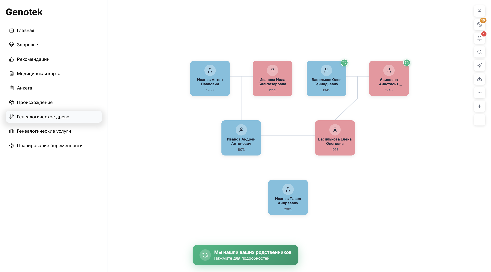

# Семейное Древо (Family Tree)

Веб-приложение для построения и управления генеалогическим древом семьи с интеллектуальным поиском совпадений и интеграцией с архивными данными.

## Возможности

### Основные функции
- 🌳 Визуализация семейного древа с автоматическим расчётом позиций
- 👤 Карточки с информацией о членах семьи
- ✏️ Редактирование данных (ФИО, дата и место рождения, описание)
- ➕ Добавление родственников (партнёр, отец, мать, сын, дочь)
- 🗑️ Удаление записей с автоматическим обновлением связей
- 💾 Автоматическое сохранение в data.json

### 🔄 SmartMatching — Умный поиск родственников
- Поиск совпадений с деревьями других пользователей
- Использование алгоритма нечёткого сравнения (RapidFuzz)
- Сравнение по ФИО, дате и месту рождения
- Возможность добавить найденных предков в своё древо одним нажатием
- Система подписок для доступа к данным других пользователей
- Запрос доступа к приватным деревьям

### 📜 Память Народа — Поиск в архивах
- Интеграция с архивом «Память народа» (pamyat-naroda.ru)
- Автоматический поиск информации о родственниках в военных архивах
- AI-суммаризация найденных данных (Llama 3.3 через OpenRouter)
- Добавление архивной информации в карточку человека

### 🎨 Современный UX/UI
- Интерактивное древо с drag-and-drop навигацией
- Масштабирование и центрирование дерева
- Цветовое кодирование по полу (голубой/розовый)
- Индикаторы найденных совпадений на карточках
- Модальные окна для редактирования и верификации совпадений
- Система уведомлений
- Обучающий тур по SmartMatching

## Структура проекта

```
ett/
├── server/                    # Backend (Node.js + Express)
│   ├── server.js              # API сервер с маршрутами
│   └── package.json
├── client/                    # Frontend (React + Vite)
│   ├── src/
│   │   ├── App.jsx            # Главный компонент с логикой приложения
│   │   ├── main.jsx           # Точка входа React
│   │   └── index.css          # Стили (CSS Variables, анимации)
│   ├── public/
│   │   └── assets/            # Статические ресурсы
│   │       ├── instruction_1.gif
│   │       ├── instruction_2.gif
│   │       └── instruction_3.gif
│   ├── index.html
│   ├── vite.config.js
│   └── package.json
├── smart_matching.py          # Модуль SmartMatching (Python)
├── pamyat_naroda.py           # Модуль Память Народа (Python)
├── data.json                  # Данные семейного древа пользователя
├── database.json              # База деревьев других пользователей
└── README.md
```

## Установка и запуск

### Требования
- Node.js 18+
- Python 3.8+
- pip

### 1. Установка зависимостей

#### Backend:
```bash
cd server
npm install
```

#### Frontend:
```bash
cd client
npm install
```

#### Python зависимости:
```bash
pip install rapidfuzz requests beautifulsoup4
```

### 2. Запуск приложения

#### Backend (в одном терминале):
```bash
cd server
node server.js
```
Сервер запустится на `http://localhost:3001`

#### Frontend (в другом терминале):
```bash
cd client
npm run dev
```
Приложение откроется на `http://localhost:5173`

## API Endpoints

### Основные операции с людьми

| Метод | Путь | Описание |
|-------|------|----------|
| GET | /api/people | Получить всех людей |
| GET | /api/people/:id | Получить человека по ID |
| GET | /api/people/:id/family | Получить человека с семейными связями |
| POST | /api/people | Создать нового человека |
| PUT | /api/people/:id | Обновить данные человека |
| DELETE | /api/people/:id | Удалить человека |
| POST | /api/people/:id/relative | Добавить родственника |

### SmartMatching API

| Метод | Путь | Описание |
|-------|------|----------|
| POST | /api/smart-matching | Запустить поиск совпадений (деревья + архивы) |
| GET | /api/people/:id/matches | Получить совпадения для конкретного человека |
| POST | /api/people/:id/confirm-match | Подтвердить совпадение с другим деревом |
| POST | /api/people/:id/confirm-archive-match | Подтвердить совпадение с архивом |

## Структура данных

### Человек (Person)

```json
{
  "id": "unique_id",
  "name": "Имя",
  "lastName": "Фамилия",
  "middleName": "Отчество",
  "gender": "male|female",
  "birthDate": "YYYY-MM-DD",
  "birthPlace": "Город",
  "fatherId": "id_отца|null",
  "motherId": "id_матери|null",
  "partnerId": "id_партнёра|null",
  "children": ["id_ребёнка1", "id_ребёнка2"],
  "isAlive": true,
  "hasMatch": false,
  "information": "Описание или данные из архива"
}
```

### База данных других деревьев (database.json)

```json
{
  "tree_id": {
    "tree001": {
      "tree_owner": "Иванов Иван Иванович",
      "people": {
        "person_id": { ... }
      }
    }
  }
}
```

### Результат SmartMatching

```json
{
  "treeMatches": [
    {
      "data_id": "id_в_вашем_дереве",
      "tree_id": "id_дерева",
      "tree_owner": "Владелец дерева",
      "database_id": "id_в_другом_дереве",
      "score": 95.5,
      "people": { ... }
    }
  ],
  "archiveMatches": [
    {
      "data_id": "id_в_вашем_дереве",
      "score": 92.3,
      "person": {
        "lastName": "Фамилия",
        "name": "Имя",
        "middleName": "Отчество",
        "birthDate": "1920",
        "birthPlace": "Место",
        "information": "AI-суммаризация архивных данных"
      }
    }
  ],
  "matchedDataIds": ["id1", "id2"]
}
```

## Технологии

### Backend
- **Node.js** — серверная среда выполнения
- **Express** — веб-фреймворк
- **CORS** — кросс-доменные запросы
- **child_process** — запуск Python скриптов

### Frontend
- **React 18** — UI библиотека
- **Vite** — сборщик и dev-сервер
- **Lucide Icons** — иконки
- **CSS Variables** — тематизация
- **CSS Grid & Flexbox** — адаптивная вёрстка

### Python модули
- **RapidFuzz** — нечёткое сравнение строк
- **BeautifulSoup4** — парсинг HTML
- **Requests** — HTTP запросы
- **OpenRouter API** — AI суммаризация (Llama 3.3)

## Алгоритм SmartMatching

SmartMatching — интеллектуальный алгоритм поиска совпадений между людьми в разных генеалогических деревьях. Использует комбинацию нечёткого сравнения строк, анализа дат и географических названий.

### Взвешенная оценка

Алгоритм использует динамическое взвешивание — веса применяются только для полей с данными:

| Поле | Вес | Описание |
|------|-----|----------|
| **Фамилия** | 0.25 | Нечёткое сравнение (RapidFuzz) |
| **Имя** | 0.20 | Нечёткое сравнение (RapidFuzz) |
| **Дата рождения** | 0.25 | Сравнение с поддержкой диапазонов |
| **Отчество** | 0.10 | Только если указано хотя бы у одного |
| **Место рождения** | 0.10 | Триграммное сравнение с фильтрацией |
| **Пол** | 0.10 | Точное совпадение (100/0) |
| **Статус (жив/умер)** | 0.05 | Точное совпадение (100/0) |

Итоговый score = Σ(score_i × weight_i) / Σ(weight_i)

### Методы сравнения

#### 1. Текстовое сравнение (ФИО)
```python
# Нормализация: lowercase, удаление пунктуации, сжатие пробелов
# Алгоритм: token_sort_ratio из RapidFuzz
# При отсутствии данных: 70 (нейтральный score)
```

#### 2. Сравнение дат рождения
Поддерживает частичные даты:
- `1920` → диапазон 01.01.1920 – 31.12.1920
- `1920-05` → диапазон 01.05.1920 – 28.05.1920  
- `1920-05-15` → точная дата

Логика сравнения:
| Условие | Score |
|---------|-------|
| Диапазоны пересекаются | 100 |
| Разница ≤ 1 года | 70 |
| Разница > 1 года | 0 |
| Данные отсутствуют | 50 |

#### 3. Сравнение мест рождения
Использует триграммный анализ с коэффициентом Жаккара:

1. **Токенизация** с фильтрацией стоп-слов:
   - Удаляются: г., город, с., село, деревня, пос., район, обл., область, край, республика, уезд, волость
   - Удаляются токены ≤ 2 символов

2. **Триграммы**: строка разбивается на 3-символьные подстроки
   - `"москва"` → `{"  м", " мо", "мос", "оск", "скв", "ква", "ва "}`

3. **Jaccard similarity**: |A ∩ B| / |A ∪ B|

4. **Финальный score**: 0.7 × best_match + 0.3 × average_match

| Jaccard | Score |
|---------|-------|
| ≥ 0.75 | 100 |
| ≥ 0.55 | 80 |
| ≥ 0.35 | 60 |
| ≥ 0.20 | 40 |
| < 0.20 | 0 |

### Порог совпадения

**90%** — минимальный score для признания совпадения.

### Пример расчёта

```
Персона A: Иванов Иван Иванович, 1920, Москва, муж., жив
Персона B: Иванов Иван Иваныч, 1920-03, г. Москва, муж., жив

lastName:   fuzz("иванов", "иванов") = 100 × 0.25 = 25.0
name:       fuzz("иван", "иван") = 100 × 0.20 = 20.0
birthDate:  пересечение диапазонов = 100 × 0.25 = 25.0
middleName: fuzz("иванович", "иваныч") = 85 × 0.10 = 8.5
birthPlace: trigram("москва", "москва") = 100 × 0.10 = 10.0
gender:     "male" == "male" = 100 × 0.10 = 10.0
isAlive:    true == true = 100 × 0.05 = 5.0

Сумма весов: 0.25 + 0.20 + 0.25 + 0.10 + 0.10 + 0.10 + 0.05 = 1.05
Итого: (25 + 20 + 25 + 8.5 + 10 + 10 + 5) / 1.05 = 98.6%
```

## Скриншоты



## Лицензия

MIT